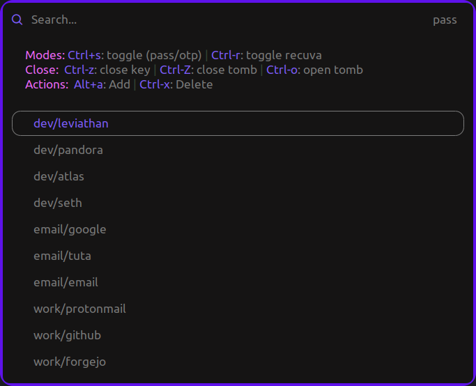

<br>

# pass-rofi: Manage Your Passwords like an Orchestra

`pass-rofi` is an efficient `rofi` script designed to complement [pass](https://github.com/janpstrunn/pass), which aims to replace the [passwordstore](https://www.passwordstore.org/) while maintaining its core principles. This tool integrates the functionalities of `pass`, `pass-otp`, and `pass-tomb` within `rofi`, enabling you to access your passwords swiftly and effortlessly.

<div align="center"><a href="https://github.com/janpstrunn/elegantvagrant/tree/main/rofi">
  
  <p>pass-rofi with Elegant Vagrant Theme</p>
</a>
</div>

## Features

- **Password Management**: Create, copy, and delete passwords with ease.
- **OTP Key Management**: Create, copy, delete, and edit OTP keys using `nano`.
- **Recovery Key Management**: Create, delete, and edit recovery keys using `nano`.
- **Tomb Management**: Open and close a `tomb` seamlessly.
- **Customizable Dialogs**: Customize master password and PIN dialog tools to suit your preferences.

## Requirements

- [pass](https://github.com/janpstrunn/pass)
- [pass-otp](https://github.com/janpstrunn/pass-otp)
- [pass-tomb](https://github.com/janpstrunn/pass-tomb)
- `rofi`

## Installation

Get started with a simple command:

```bash
curl -sSL https://github.com/janpstrunn/pass-rofi/raw/main/install.sh | bash
```

## Usage

```
  ---------------------------------------------------
  ---------------------pass-rofi---------------------
  ---------------------------------------------------
  -------------A rofi extension for pass-------------
  ---------------------------------------------------

pass-rofi: A rofi extension for pass

Usage: $0 [options] <command> [arguments]

Options:
  -d             Enable custom dialog
  -e             Exhume buried key to unlock a tomb
  -k [-e -g]     Specify a Tomb Key if not present in .passrc
  -g             Create a tomb key using GPG ID
  -h             Display this help message and exit
  -v             Display the current version number

Commands:
  help                     Display this help message and exit
  version                  Display the current version number

Examples:
  pass-rofi -e -g -k tomb.key
                 # Use a GPG key that is buried to unlock a tomb
```

> [!IMPORTANT]
> First-time users must set up [pass](https://github.com/janpstrunn/pass) before using `pass-rofi`.

## Notes

This script has been tested exclusively on a Linux machine.

## License

This repository is licensed under the MIT License, allowing for extensive use, modification, copying, and distribution.
